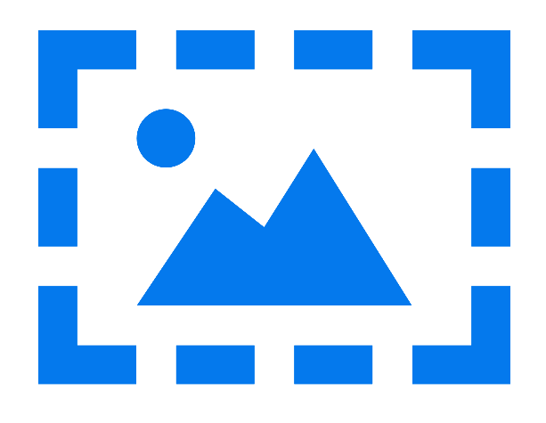

<h1 align="center">
  <br>
  
  <br>
  Image Processing
  <br>
</h1>

<p align="center">
  • <a href="#introduccion">Introducción</a> 
  • <a href="#primeros-pasos">Primeros pasos</a> 
</p>

## Introduccion

En este repositorio se concentran algunos de los trabajos realizados para la materia Procesamiento de Imágenes, de la especialización en Procesamiento de señales de la carrera Ingeniería Electrónica en el Instituto Tecnológico de Buenos Aires (ITBA).

Los proyectos estan ordenados según el número de trabajo práctico en el que fueron asignados, por esa razon se encuentran dentro de carpetas con la estructura: TP1, TP2, etc.

Cada una de estas carpetas contiene la consigna del trabajo brindado por la cátedra, los archivos necesarios para hacerlo y un archivo o conjunto de archivos Jupyter Notebooks en los que se resuelve el ejercicio planteado, todos ellos relacionados al procesamiento de imágenes.

## Primeros pasos

Los trabajos estan realizados todos dentro de archivos Jupyter Notebooks, cada uno se encuentra en la carpeta del trabajo correspondiente. Todos los archivos Jupyter se pueden visualizar dentro del navegador a travez de la interfaz de github. De todas formas para correr las celdas o para poder visualizar de forma correcta algunas de las interfaces de usuarios sí es necesario utilizar la versión local en la computadora.

Para correr localmente las Notebooks correspondientes a los trabajos, primero hay que clonar el repositorio:

```
git clone https://github.com/matifrancois/Image-Processing.git
```	

Luego se puede correr cada notebook desde la interfaz de Jupyter o utilizando IDEs que permitan la visualización de código escrito en Jupyter Notebooks, como por ejemplo PyCharm o Visual Studio Code (con la extensión Jupyter Notebook).

En el caso de querer correr localmente las notebook se deben instalar las librerías correspondientes en cada caso.
